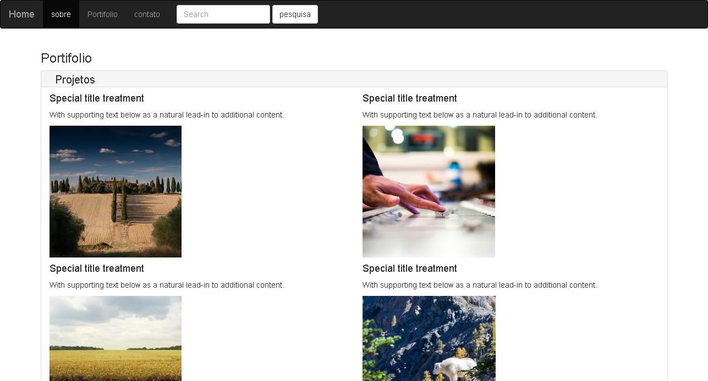
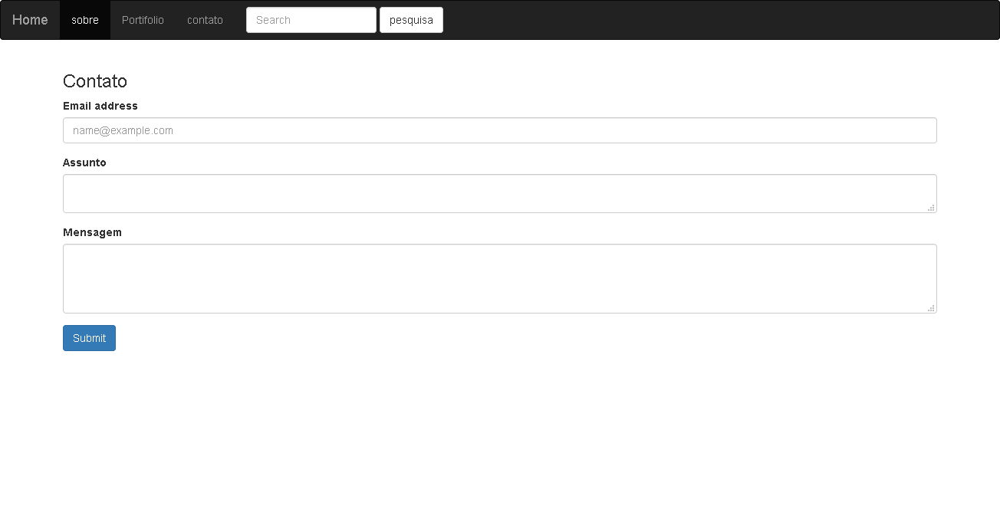

# website-com-flask
pagina simples rodando no pythonanywhere  a ideia aqui foi desenvolver um site simples com flask
LINK: https://replit.com/@juanengml/website-com-flask


### Deploy Aplicação 

```console

foo@bar:~$ sudo docker run -d -p 80:80 --restart=always srmarinho/website-com-flask:latest 

```



